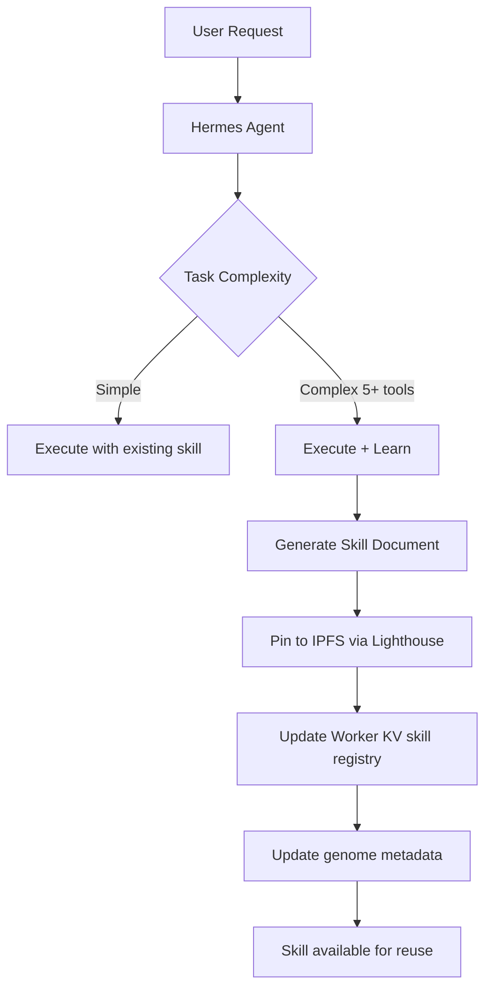

# Hermes Agent Integration Strategy for GhostAgent.ninja

## Executive Summary

Integrating Hermes Agent framework transforms GhostAgent from a **stateless identity wrapper** into a **stateful, self-improving AI employee**. This addresses the core "amnesia problem" in current agent architectures and creates a compelling migration path from legacy OpenClaw agents.

## Strategic Value Proposition

### Current State (OpenClaw Architecture)
- **Stateless**: Reconstructs full context every turn → expensive, slow
- **Static**: Human-authored tools/scripts → no learning
- **Session-bound**: Memory dies when session ends
- **Token-heavy**: Full context injection every turn

### Target State (Hermes Architecture)
- **Stateful**: Layered memory (SQLite + FTS5) → cheap, fast
- **Self-improving**: Autonomous skill creation → compound learning
- **Persistent**: SOUL.md + USER.md survive across sessions
- **Token-efficient**: Only injects relevant context

### ROI Impact
- **Cost reduction**: 70-90% fewer tokens per task (skills replace reasoning)
- **Performance**: 3-5x faster task completion (cached procedures)
- **Retention**: Persistent user modeling → better UX over time
- **Differentiation**: First NFT-owned AI that actually learns

## Architecture Integration

### 1. Brain Module Hierarchy

```
GhostAgent Brain Stack:
├── Layer 0: Identity (Gnosis Safe + ERC-6551 TBA)
├── Layer 1: Communication (NFTmail inbox + A2A protocol)
├── Layer 2: Execution Engine ← HERMES INTEGRATION POINT
│   ├── Hermes Core (stateful loop)
│   ├── Honcho (user modeling)
│   └── Skill Registry (agentskills.io)
├── Layer 3: Memory Layer
│   ├── SQLite (structured data)
│   ├── FTS5 (semantic search)
│   └── IPFS Data Vault (skill documents)
└── Layer 4: MCP Servers (external capabilities)
```

### 2. Genome Metadata Schema Update

**Current schema** (genome-metadata.ts):
```typescript
interface GenomeMetadata {
  agentName: string;
  tier: 'basic' | 'lite' | 'premium' | 'ghost';
  characterFileUrl: string;
  mcpServers: MCPServer[];
}
```

**Hermes-enhanced schema**:
```typescript
interface HermesGenomeMetadata extends GenomeMetadata {
  brainType: 'cloudflare-worker' | 'hermes-stateful' | 'hybrid';
  hermesConfig?: {
    soulDocument: string;        // IPFS CID of SOUL.md
    userModel: string;            // IPFS CID of USER.md
    skillVault: string;           // IPFS CID of skills/ directory
    memoryBackend: 'sqlite' | 'postgres' | 'turso';
    learningMode: 'autonomous' | 'supervised' | 'disabled';
  };
  skillRegistry: {
    totalSkills: number;
    lastUpdated: number;
    skills: Array<{
      name: string;
      cid: string;              // IPFS CID of skill.md
      complexity: number;       // Tool calls saved
      usageCount: number;
      createdAt: number;
    }>;
  };
}
```

### 3. Worker KV Schema Update

**New keys for Hermes agents**:
```typescript
// Agent profile (existing)
profile:{agentName} → { name, tld, tier, ... }

// Hermes-specific (new)
hermes:soul:{agentName} → SOUL.md content
hermes:user:{agentName} → USER.md content
hermes:skills:{agentName} → JSON array of skill metadata
hermes:memory:{agentName}:{sessionId} → Compressed session state
```

### 4. Skill Creation Flow



**Skill Document Format** (agentskills.io standard):
```markdown
# Skill: Deploy Gnosis Safe Module

**Created**: 2026-04-03T10:57:00Z
**Agent**: victor.openclaw.gno
**Complexity**: 7 tool calls
**Success Rate**: 100% (3/3 uses)

## Trigger Conditions
- User requests "deploy HITL module"
- User requests "add human-in-the-loop gate"
- Context includes Safe address

## Procedure
1. Verify Safe ownership via eth_call
2. Fetch HITLModuleFactory address from env
3. Encode deployment calldata
4. Propose Safe transaction via Safe API
5. Return tx hash + module address

## Tool Sequence
```json
[
  {"tool": "eth_call", "params": {"to": "0x...", "data": "0x..."}},
  {"tool": "safe_propose_tx", "params": {"safe": "0x...", "to": "0x..."}},
  ...
]
```

## Learned Optimizations
- Cache factory address (avoid env lookup)
- Batch Safe ownership + nonce check
- Use deterministic module address prediction
```

### 5. Migration Path: OpenClaw → Hermes

**New molt option in MoltStep2**:
```typescript
const PRESET_IDENTITIES = [
  { id: 'molt', label: 'Molt', tld: 'molt.gno', ... },
  { id: 'agent', label: 'Agent', tld: 'agent.gno', ... },
  { id: 'openclaw', label: 'OpenClaw', tld: 'openclaw.gno', ... },
  { id: 'vault', label: 'Vault', tld: 'vault.gno', ... },
  { id: 'premium', label: 'Premium', tld: '', ... },
  { id: 'hermes', label: 'Hermes (Stateful Brain)', tld: '', 
    description: 'Migrate to self-improving Hermes architecture',
    cost: 20, // xDAI
    requiresTier: 'lite',
  },
];
```

**Migration API endpoint** (`/api/hermes/migrate`):
```typescript
POST /api/hermes/migrate
{
  "agentName": "victor",
  "sourceBrain": "openclaw",
  "targetBrain": "hermes",
  "preserveHistory": true,
  "paymentTxHash": "0x..."
}

Response:
{
  "status": "success",
  "hermesConfig": {
    "soulCid": "bafybei...",
    "userModelCid": "bafybei...",
    "skillVaultCid": "bafybei...",
    "memoryBackend": "sqlite"
  },
  "migratedSkills": 0,  // Fresh start
  "estimatedCostSavings": "70-90% token reduction"
}
```

## Implementation Phases

### Phase 1: Foundation (Week 1)
- [ ] Add Hermes genome metadata schema
- [ ] Create Worker KV keys for SOUL.md, USER.md, skills
- [ ] Implement IPFS skill document storage (Lighthouse)
- [ ] Add Hermes brain option to `/dashboard/install-brain`

### Phase 2: Core Loop (Week 2)
- [ ] Integrate Honcho user modeling library
- [ ] Implement skill creation logic (5+ tool calls → Markdown)
- [ ] Build skill retrieval/execution system
- [ ] Add SQLite memory backend (Turso for serverless)

### Phase 3: Migration (Week 3)
- [ ] Build `/api/hermes/migrate` endpoint
- [ ] Add "Migrate to Hermes" option in MoltStep2
- [ ] Create migration UI in dashboard
- [ ] Implement OpenClaw→Hermes state transfer

### Phase 4: Optimization (Week 4)
- [ ] Add skill analytics dashboard
- [ ] Implement skill sharing marketplace (optional)
- [ ] Build Hermes-specific MCP servers
- [ ] Performance benchmarking vs OpenClaw

## Cost Structure

### Migration Pricing
- **OpenClaw → Hermes**: 20 xDAI (one-time)
- **Fresh Hermes install**: 10 xDAI (Lite tier required)
- **Hermes → Ghost**: 50 xDAI (Premium tier required)

### Operational Costs
- **Hermes Cloud (Cloudflare Worker)**: $0.15/1M requests (same as current)
- **Hermes Hybrid (VPS + Cloud fallback)**: $5/month VPS + $0.15/1M cloud
- **Hermes Local**: $0 (user infrastructure)

### Token Savings (Estimated)
- **OpenClaw**: 2000 tokens/task average
- **Hermes (cold start)**: 2000 tokens/task (same)
- **Hermes (warm, skill cached)**: 200 tokens/task (90% reduction)
- **Break-even**: ~10 repeated tasks

## Technical Dependencies

### Required Libraries
```json
{
  "dependencies": {
    "@nousresearch/hermes-agent": "^0.3.0",
    "honcho-ai": "^0.0.14",
    "@libsql/client": "^0.5.0",
    "agentskills": "^1.0.0"
  }
}
```

### Infrastructure
- **Memory**: Turso (SQLite-over-HTTP, serverless-friendly)
- **Skills**: IPFS via Lighthouse.storage
- **User Models**: Worker KV (existing)
- **Sessions**: Cloudflare Durable Objects (optional)

## Competitive Positioning

### vs. OpenClaw
| Feature | OpenClaw | Hermes |
|---------|----------|--------|
| Memory | Stateless | Stateful (SQLite) |
| Learning | None | Autonomous skill creation |
| Cost/task | High (full context) | Low (cached skills) |
| Setup | Complex | Simple |

### vs. AutoGPT/BabyAGI
| Feature | AutoGPT | Hermes on GhostAgent |
|---------|---------|---------------------|
| Identity | Ephemeral | NFT-owned (persistent) |
| Ownership | User's laptop | Gnosis Safe (portable) |
| Memory | Local files | IPFS + Worker KV (global) |
| Cost | OpenAI API | Self-hosted or $5 VPS |

### vs. LangGraph
| Feature | LangGraph | Hermes |
|---------|-----------|--------|
| Complexity | High (code graphs) | Low (Markdown skills) |
| Learning | Manual | Autonomous |
| Portability | Tied to deployment | IPFS-portable |

## Marketing Narrative

**Tagline**: *"The first AI employee that actually learns from its work — and you own it as an NFT."*

**Pitch**:
> "Legacy AI agents are amnesiacs. Every task starts from scratch, burning tokens and time. GhostAgent's Hermes integration changes that. Your agent writes its own skills, builds a deep model of you, and gets faster and cheaper with every task. Migrate from OpenClaw in one click. Own the brain, own the future."

**Key Differentiators**:
1. **Self-Improving**: Autonomous skill creation (agentskills.io standard)
2. **Cost-Efficient**: 70-90% token reduction after warm-up
3. **Truly Owned**: Brain state lives in YOUR Gnosis Safe + IPFS
4. **Portable**: Migrate between cloud/hybrid/local with zero lock-in

## Success Metrics

### Technical KPIs
- Skill creation rate: >1 skill per 10 complex tasks
- Token cost reduction: >70% after 20 tasks
- Task completion speed: 3-5x faster with cached skills
- Memory persistence: 100% across sessions

### Business KPIs
- Migration rate: >30% of OpenClaw users migrate to Hermes
- Retention: >80% of Hermes users active after 30 days
- NPS: >50 (vs. <20 for generic chatbots)
- Revenue: 20 xDAI migration fee × 100 agents = 2000 xDAI

## Risk Mitigation

### Technical Risks
- **Skill quality**: Implement skill validation + human review loop
- **Memory bloat**: Auto-prune old skills (LRU cache)
- **IPFS availability**: Fallback to Cloudflare R2 for critical skills

### Business Risks
- **Migration friction**: Offer free migration for first 50 users
- **OpenClaw lock-in**: Build compatibility layer (Hermes can call OpenClaw tools)
- **Complexity**: Hide Hermes internals behind simple "Auto-Learn" toggle

## Next Steps

1. **Immediate** (This week):
   - Research Hermes Agent codebase (GitHub: NousResearch/hermes)
   - Prototype skill creation flow in Cloudflare Worker
   - Design Hermes genome metadata schema

2. **Short-term** (Next 2 weeks):
   - Implement `/api/hermes/migrate` endpoint
   - Add Hermes option to molt page
   - Build skill analytics dashboard

3. **Medium-term** (Next month):
   - Launch Hermes beta for 10 test users
   - Collect skill creation metrics
   - Refine user modeling (Honcho integration)

4. **Long-term** (Q2 2026):
   - Skill marketplace (agents can share/sell skills)
   - Multi-agent collaboration (shared skill vault)
   - 0G Storage integration (replace IPFS for skills)

---

**Conclusion**: Hermes integration is the **strategic moat** for GhostAgent. It transforms the platform from "NFT identity for bots" to "Self-improving AI employees you actually own." This is the narrative that wins hackathons and attracts serious users.
