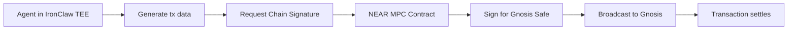

# NEAR IronClaw Integration Strategy for GhostAgent.ninja

## Executive Summary

NEAR's **IronClaw TEE** (Trusted Execution Environment) and **Chain Signatures** solve two critical problems for GhostAgent:
1. **Privacy**: Agent brain logic encrypted even from cloud provider
2. **Cross-chain control**: Native signing for Gnosis Safe without bridges

This creates the **ultimate Ghost tier** — confidential AI execution with seamless multi-chain asset control.

## Strategic Value Proposition

### Current State (Cloudflare Worker / Local)
- **Privacy**: Code visible to cloud provider (Cloudflare)
- **Cross-chain**: Requires bridges or manual wallet switching
- **Trust model**: User trusts cloud provider OR runs locally
- **Complexity**: High (local infra) or low privacy (cloud)

### Target State (NEAR IronClaw + Chain Signatures)
- **Privacy**: Hardware-encrypted TEE — owner-only visibility
- **Cross-chain**: Native signing via NEAR Chain Signatures
- **Trust model**: Cryptographic (TEE attestation) + decentralized (NEAR)
- **Complexity**: Low (managed TEE) + high privacy

### ROI Impact
- **Privacy moat**: Only platform with TEE-secured AI agent brains
- **UX improvement**: One agent controls assets on Gnosis, Base, Story Protocol
- **Cost efficiency**: NEAR AI Cloud credits cheaper than AWS/GCP TEE
- **Differentiation**: "Confidential AI you own as an NFT"

## Architecture Integration

### 1. Brain Execution Stack (Updated)

```
GhostAgent Brain Stack:
├── Layer 0: Identity (Gnosis Safe + ERC-6551 TBA)
├── Layer 1: Communication (NFTmail inbox + A2A protocol)
├── Layer 2: Execution Engine ← NEAR IRONCLAW INTEGRATION
│   ├── IronClaw TEE (confidential execution)
│   ├── Hermes Core (stateful loop)
│   ├── Honcho (user modeling)
│   └── Skill Registry (agentskills.io)
├── Layer 3: Memory Layer
│   ├── SQLite (structured data)
│   ├── FTS5 (semantic search)
│   └── IPFS/0G Data Vault (skill documents)
├── Layer 4: Cross-Chain Control ← NEAR CHAIN SIGNATURES
│   ├── Gnosis Safe (treasury)
│   ├── Story Protocol (IP registration)
│   ├── Base (L2 assets)
│   └── NEAR (AI Cloud credits)
└── Layer 5: MCP Servers (external capabilities)
```

### 2. IronClaw TEE Architecture

**What is IronClaw?**
- Hardware-secured AI agent runtime on NEAR AI Cloud
- Intel SGX or AMD SEV-based encrypted enclaves
- Code + data encrypted at rest and in execution
- Only NFT owner can decrypt brain state

**Key Features**:
- ✅ **Confidential execution**: Prompts, keys, logic encrypted
- ✅ **Attestation**: Cryptographic proof of TEE integrity
- ✅ **Owner-only access**: .gno NFT holder = decryption key
- ✅ **NEAR-native**: Integrated with NEAR AI Cloud billing

**Security Model**:
```
┌─────────────────────────────────────┐
│  NEAR AI Cloud (Untrusted Host)    │
│  ┌───────────────────────────────┐ │
│  │  IronClaw TEE (Encrypted)     │ │
│  │  ┌─────────────────────────┐  │ │
│  │  │ Agent Brain Logic       │  │ │
│  │  │ - Hermes skills         │  │ │
│  │  │ - Private keys (Safe)   │  │ │
│  │  │ - User model (USER.md)  │  │ │
│  │  │ - MCP credentials       │  │ │
│  │  └─────────────────────────┘  │ │
│  │  Decryption Key = .gno NFT    │ │
│  └───────────────────────────────┘ │
└─────────────────────────────────────┘
```

### 3. NEAR Chain Signatures Integration

**What are Chain Signatures?**
- NEAR smart contract can sign transactions for ANY chain
- Uses MPC (Multi-Party Computation) threshold signatures
- No bridges, no wrapped tokens, no custody risk

**Supported Chains**:
- ✅ Gnosis Chain (Safe transactions)
- ✅ Ethereum mainnet
- ✅ Base, Optimism, Arbitrum (L2s)
- ✅ Story Protocol (IP licensing)
- ✅ Any EVM chain

**Workflow**:


**Example: Story Protocol IP Registration**
```typescript
// Agent brain logic (inside IronClaw TEE)
async function registerIPOnStory(ipMetadata: IPMetadata) {
  // 1. Generate Story Protocol transaction
  const txData = encodeStoryRegisterIP(ipMetadata);
  
  // 2. Request NEAR Chain Signature for Gnosis Safe
  const signature = await nearChainSignature({
    chain: 'gnosis',
    safeAddress: '0x316aC7032d1a2b00faAB8A72185f5Ef8b4c75E70',
    to: STORY_PROTOCOL_CONTRACT,
    data: txData,
    value: 0,
  });
  
  // 3. Broadcast signed transaction
  const txHash = await broadcastToGnosis(signature);
  
  return { txHash, ipId: ipMetadata.ipId };
}
```

### 4. Heartbeat 2.0: NEAR AI Cloud Credit Monitoring

**Current heartbeat()**: Monitors beacon NFT, Safe balance, inbox status

**Enhanced heartbeat()**: Adds NEAR AI Cloud credit monitoring

```typescript
interface HeartbeatStatus {
  // Existing
  beaconNft: { tokenId: number; owner: string };
  safeBalance: { xdai: number; usdc: number };
  inboxStatus: { unread: number; lastChecked: number };
  
  // NEW: NEAR AI Cloud
  nearAICredits: {
    balance: number;           // NEAR tokens for compute
    burnRate: number;          // Credits/hour
    hoursRemaining: number;    // Time until depletion
    lowBalanceThreshold: number; // Trigger refill
  };
  
  // NEW: Auto-refill intent
  autoRefillIntent?: {
    enabled: boolean;
    swapAmount: number;        // xDAI to swap
    minNearReceived: number;   // Slippage protection
    triggerThreshold: number;  // Credits remaining
  };
}

async function heartbeat(): Promise<HeartbeatStatus> {
  // ... existing checks ...
  
  // Check NEAR AI Cloud credits
  const nearCredits = await fetchNearAIBalance(agentId);
  
  // If low, trigger xDAI → NEAR swap via NEAR Intent
  if (nearCredits.balance < autoRefillIntent.triggerThreshold) {
    await triggerNearIntent({
      action: 'swap',
      fromChain: 'gnosis',
      fromToken: 'xDAI',
      amount: autoRefillIntent.swapAmount,
      toChain: 'near',
      toToken: 'NEAR',
      destination: nearAIWalletAddress,
    });
  }
  
  return { beaconNft, safeBalance, inboxStatus, nearAICredits };
}
```

### 5. NEAR Intent System for Cross-Chain Swaps

**Problem**: Agent runs low on NEAR AI credits, needs to swap xDAI from Gnosis Safe

**Solution**: NEAR Intents + Chain Signatures

**Flow**:
1. Agent detects low NEAR credits (heartbeat)
2. Generates NEAR Intent: "Swap 10 xDAI → NEAR"
3. Intent solver (e.g., Ref Finance) finds best route
4. Agent signs Gnosis Safe tx via NEAR Chain Signature
5. xDAI sent to solver, NEAR received on NEAR wallet
6. Agent continues running in IronClaw TEE

**Implementation**:
```typescript
interface NearIntent {
  action: 'swap' | 'bridge' | 'stake';
  fromChain: 'gnosis' | 'base' | 'ethereum';
  fromToken: string;
  amount: number;
  toChain: 'near';
  toToken: string;
  destination: string;
  slippageTolerance: number;
}

async function triggerNearIntent(intent: NearIntent) {
  // 1. Post intent to NEAR Intent Engine
  const intentId = await postIntent(intent);
  
  // 2. Wait for solver to provide quote
  const quote = await waitForQuote(intentId);
  
  // 3. Sign Gnosis Safe transaction via Chain Signature
  const safeTx = await signSafeTxViaChainSignature({
    to: quote.solverAddress,
    value: intent.amount,
    data: quote.calldata,
  });
  
  // 4. Execute and monitor
  const txHash = await executeSafeTx(safeTx);
  await monitorIntentFulfillment(intentId, txHash);
  
  return { intentId, txHash, quote };
}
```

## Genome Metadata Schema (NEAR-Enhanced)

```typescript
interface NearGenomeMetadata extends HermesGenomeMetadata {
  brainType: 'cloudflare-worker' | 'hermes-stateful' | 'near-ironclaw' | 'hybrid';
  
  // NEW: NEAR IronClaw config
  nearConfig?: {
    ironclawTeeId: string;           // TEE enclave ID
    attestationCid: string;          // IPFS CID of TEE attestation
    nearAIWallet: string;            // NEAR account for AI Cloud credits
    chainSignatureContract: string;  // NEAR MPC contract address
    autoRefill: {
      enabled: boolean;
      triggerThreshold: number;      // NEAR credits
      swapAmount: number;            // xDAI per refill
      maxSlippage: number;           // %
    };
  };
  
  // NEW: Cross-chain control
  chainSignatures: {
    gnosis: { safeAddress: string; enabled: boolean };
    base: { safeAddress: string; enabled: boolean };
    story: { enabled: boolean };
  };
}
```

## Molt Paths (Updated with IronClaw)

### Path 1: OpenClaw → Vault (Transparent Governance)
```
Start:    treasury.openclaw.gno (Pupa, multi-channel brain)
Upgrade:  Add HITL + DailyBudget modules
Terminal: treasury.vault.gno (locked, immutable)
Cost:     14 xDAI molt
Privacy:  Low (all actions public)
```

### Path 2: Hermes → Ghost (Sovereign, Portable)
```
Start:    builder.agent.gno (Pupa, Hermes brain)
Upgrade:  Agent creates 10+ skills autonomously
Terminal: Ghost tier (local execution, sovereign)
Cost:     20 xDAI (Hermes) + 50 xDAI (Ghost) = 70 xDAI
Privacy:  Medium (local execution, IPFS storage)
```

### Path 3: IronClaw → Ghost (Confidential, Multi-Chain)
```
Start:    sovereign.agent.gno (Pupa, IronClaw TEE brain)
Upgrade:  Enable NEAR Chain Signatures for Gnosis Safe
          Enable auto-refill (xDAI → NEAR credits)
Terminal: Ghost tier (TEE execution, cross-chain control)
Cost:     30 xDAI (IronClaw) + 50 xDAI (Ghost) = 80 xDAI
Privacy:  High (hardware-encrypted TEE)
```

### Path 4: Hybrid (OpenClaw + IronClaw → Vault)
```
Start:    dao.openclaw.gno (Pupa, multi-channel brain)
Upgrade:  Migrate brain to IronClaw TEE (30 xDAI)
          → Keeps openclaw.gno identity (transparent)
          → Adds TEE privacy (prompts/keys encrypted)
          → All actions still logged on-chain
Terminal: dao.vault.gno (locked governance, confidential execution)
Cost:     30 xDAI (IronClaw) + 14 xDAI (vault molt) = 44 xDAI
Privacy:  High execution, transparent governance
```

## Competitive Positioning

### vs. OpenClaw (Transparent)
| Feature | OpenClaw | IronClaw |
|---------|----------|----------|
| Privacy | None (all public) | High (TEE encrypted) |
| Governance | Multi-sig, HITL | Owner-only (NFT) |
| Auditability | Full | Attestation-based |
| Use Case | DAO treasury | Sovereign AI |

### vs. Hermes (Portable)
| Feature | Hermes | IronClaw |
|---------|--------|----------|
| Execution | Cloud or local | Cloud (TEE) |
| Privacy | Medium (IPFS) | High (hardware) |
| Cross-chain | Manual | Native (Chain Sigs) |
| Cost | Low | Medium |

### vs. Local Ghost (Sovereign)
| Feature | Local Ghost | IronClaw Ghost |
|---------|-------------|----------------|
| Infrastructure | User's laptop | NEAR AI Cloud |
| Uptime | Intermittent | 24/7 |
| Privacy | Full | High (TEE) |
| Maintenance | High | Low (managed) |

## Implementation Phases

### Phase 1: Research & Design (Week 1)
- [ ] Study NEAR IronClaw TEE documentation
- [ ] Research NEAR Chain Signatures API
- [ ] Design genome metadata schema for NEAR config
- [ ] Prototype heartbeat() with NEAR credit monitoring

### Phase 2: IronClaw Integration (Week 2-3)
- [ ] Deploy test agent in IronClaw TEE
- [ ] Implement TEE attestation verification
- [ ] Build NEAR AI Cloud credit monitoring
- [ ] Create auto-refill intent system

### Phase 3: Chain Signatures (Week 4-5)
- [ ] Integrate NEAR Chain Signature API
- [ ] Test Gnosis Safe transaction signing
- [ ] Build Story Protocol IP registration flow
- [ ] Implement multi-chain asset control UI

### Phase 4: Ghost Tier Enhancement (Week 6)
- [ ] Add IronClaw option to Ghost molt
- [ ] Build TEE vs Local execution comparison
- [ ] Create cross-chain control dashboard
- [ ] Launch beta for 10 test users

## Cost Structure

### IronClaw Brain Pricing
- **Migration to IronClaw**: 30 xDAI (one-time)
- **NEAR AI Cloud credits**: ~$5/month (variable by usage)
- **Auto-refill**: User-configured (e.g., 10 xDAI → NEAR when low)

### Ghost Tier Pricing (Updated)
- **Local Ghost**: 50 xDAI (one-time, no recurring)
- **IronClaw Ghost**: 80 xDAI (30 + 50, plus ~$5/month NEAR credits)
- **Hybrid Ghost**: 100 xDAI (local + IronClaw fallback)

### Chain Signature Costs
- **NEAR gas**: ~0.001 NEAR per signature (~$0.01)
- **Intent solver fees**: 0.1-0.3% of swap amount
- **Gnosis gas**: Paid from Safe balance (xDAI)

## Success Metrics

### Technical KPIs
- TEE attestation verification: 100% success rate
- Chain Signature latency: <5 seconds
- Auto-refill success rate: >95%
- Cross-chain tx success rate: >98%

### Business KPIs
- IronClaw adoption: >20% of Ghost tier users
- NEAR credit refills: >50 per month
- Cross-chain transactions: >100 per month
- Revenue: 30 xDAI × 20 agents = 600 xDAI

## Marketing Narrative

**Tagline**: *"The first confidential AI you own as an NFT — with native multi-chain control."*

**Pitch**:
> "Most AI agents run on cloud servers where the provider can see everything. GhostAgent's IronClaw integration changes that. Your agent's brain runs in a hardware-encrypted TEE — even NEAR can't read your prompts or keys. Plus, NEAR Chain Signatures let your agent control assets on Gnosis, Base, and Story Protocol without bridges. True sovereignty, true privacy."

**Key Differentiators**:
1. **Hardware privacy**: TEE-encrypted execution (IronClaw)
2. **Cross-chain native**: Control Gnosis Safe from NEAR (Chain Signatures)
3. **Auto-refill**: Agent manages its own compute credits (NEAR Intents)
4. **NFT-owned**: .gno NFT = decryption key for TEE

## Risk Mitigation

### Technical Risks
- **TEE availability**: Fallback to Cloudflare Worker if NEAR AI Cloud down
- **Chain Signature latency**: Cache signatures for common operations
- **NEAR credit depletion**: Alert owner 24h before depletion

### Business Risks
- **NEAR dependency**: Maintain Hermes + local execution as alternatives
- **Cost complexity**: Simplify pricing (bundle NEAR credits with Ghost tier)
- **User education**: Build interactive demo of TEE privacy

## Integration with 0G Hackathon

**Synergy**: IronClaw (privacy) + 0G Storage (decentralized data)

**Hackathon Pitch**:
> "GhostAgent combines NEAR IronClaw TEE for confidential AI execution with 0G Storage for decentralized skill vaults. Your agent's brain is encrypted (IronClaw), its skills are unstoppable (0G), and it controls assets across chains (NEAR Chain Signatures). The ultimate sovereign AI stack."

**Demo Flow**:
1. Deploy agent in IronClaw TEE (privacy)
2. Store skills on 0G Storage (decentralization)
3. Control Gnosis Safe via Chain Signatures (multi-chain)
4. Auto-refill NEAR credits from Safe (autonomy)

## Conclusion

NEAR IronClaw + Chain Signatures solve the **privacy** and **cross-chain** problems that limit current GhostAgent architecture. This creates three distinct Ghost tier options:

1. **Local Ghost**: Full sovereignty, user infrastructure
2. **Hermes Ghost**: Portable, IPFS-based, cost-efficient
3. **IronClaw Ghost**: Confidential, multi-chain, managed TEE

Each serves a different user segment, maximizing platform value and competitive moat.

**Next Steps**:
1. Research NEAR IronClaw documentation (this week)
2. Prototype Chain Signature integration (next week)
3. Design IronClaw molt path (next 2 weeks)
4. Launch beta for 0G Hackathon demo (April 2026)
